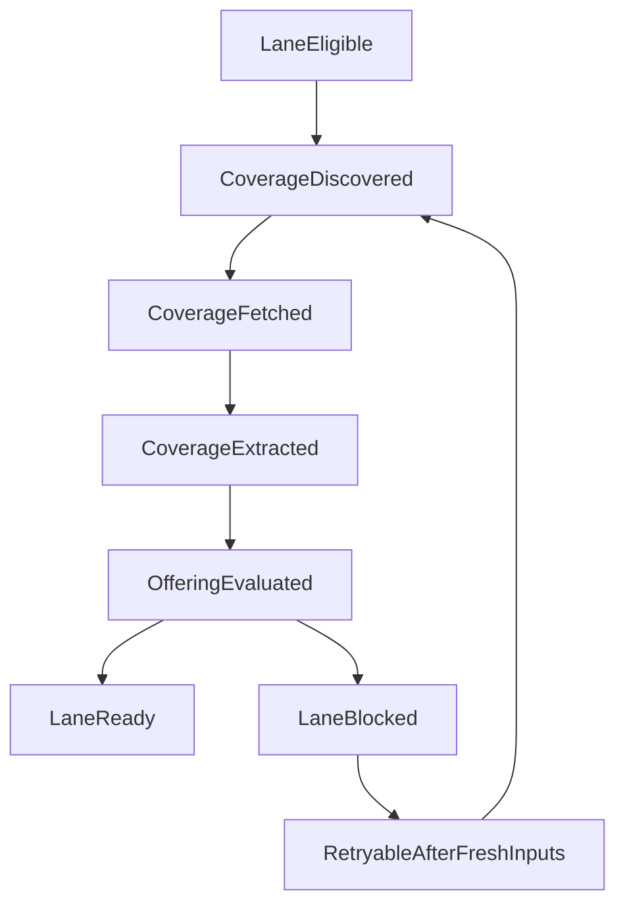

# Enrichment Orchestrator v2 State Machine Spec

Companion operator runbook:
`docs/architecture/enrichment-orchestrator-v2-execution-checklist.md`

## Scope

This spec defines v2 orchestration for the **autocomplete lane** after ERA Stage 7:

1. Coverage discovery
2. Coverage fetch
3. Coverage extraction
4. Offering program assembly
5. Interpretation refresh (tagline reprocess)

The v2 scope is orchestration reliability and observability, not a rewrite of extraction logic.

## Problem Statement

Current enrichment logic is idempotent but handoff between downstream steps can still be opaque.
The system now has shared orchestration reasons, no-silent-drop menu fetch logging, readiness gates,
and a scorecard. v2 formalizes these into a deterministic state machine so operators can answer:

- What state is this entity in?
- Why is it blocked?
- What should run next automatically?
- When is the lane safe to cut over fully?

## Non-Goals

- Replacing core Stage 1-7 ERA behavior.
- Redesigning extraction prompts/models.
- Changing product rendering rules.
- Expanding schema scope beyond what orchestration requires.
- Removing existing script entry points in this phase.

## State Model

The v2 machine is per-entity, per-lane run, and is driven by observed evidence + derived signals.

### States

- `LaneEligible`: Stage 7 has completed (or was skipped by policy) and lane may run.
- `CoverageDiscovered`: coverage URLs registered for this pass (including zero-result completion).
- `CoverageFetched`: all discoverable coverage URLs attempted fetch with persisted outcome.
- `CoverageExtracted`: extraction attempted for fetched sources.
- `OfferingEvaluated`: offering assembly attempted and readiness evaluated.
- `LaneReady`: offering readiness is true and interpretation refresh is permitted.
- `LaneBlocked`: readiness false with explicit machine-readable reasons.
- `RetryableAfterFreshInputs`: blocked state with known recovery path (new fetches/signals/coverage).

## Block Reasons Contract

Reasons are machine-readable and must come from shared constants in
`lib/enrichment/orchestration-reasons.ts`.

Required reason families:

- Discovery/fetch handoff:
  - `NO_MENU_SURFACES_DISCOVERED`
  - `MENU_SURFACES_DISCOVERED_NOT_FETCHED`
  - `MENU_FETCH_HTTP_ERROR`
  - `MENU_FETCH_FAILED`
  - `MENU_FETCH_EMPTY_TEXT`
  - `MENU_CORPUS_STALE`
- Interpretation readiness:
  - `NO_MENU_IDENTITY_SIGNAL`
  - `NO_MENU_STRUCTURE_SIGNAL`
  - `MENU_IDENTITY_STALE`
  - `MENU_STRUCTURE_STALE`
- Coverage readiness:
  - `NO_COVERAGE_EVIDENCE`
  - `COVERAGE_STALE`

Rules:

- Reasons are append-only for compatibility.
- Every blocked offering evaluation must emit at least one reason.
- No free-text-only failures in lane summaries; text may be attached, but reason enums are primary.

## Transition Rules (Deterministic)

1. `LaneEligible -> CoverageDiscovered`
   - Trigger: lane starts for entity.
   - Determinism: same target selection query + same freshness windows produce same candidate set.

2. `CoverageDiscovered -> CoverageFetched`
   - Trigger: all coverage sources in discovered set have a fetch attempt recorded.
   - Determinism: every attempt persists outcome (success/failure), no silent drops.

3. `CoverageFetched -> CoverageExtracted`
   - Trigger: extraction attempted for all fetch-success rows for the run window.

4. `CoverageExtracted -> OfferingEvaluated`
   - Trigger: offering assembly runs once with latest menu identity, structure, and coverage evidence.

5. `OfferingEvaluated -> LaneReady`
   - Condition: `isReadyForOfferingAssembly = true` with empty `gateReasons`.

6. `OfferingEvaluated -> LaneBlocked`
   - Condition: `isReadyForOfferingAssembly = false` and `gateReasons.length > 0`.

7. `LaneBlocked -> RetryableAfterFreshInputs`
   - Trigger: a known missing/stale dependency gets refreshed and reason set changes.

## SLO Denominator Definitions (Authoritative)

These definitions are normative and match the scorecard implementation.

1. **Discovery->Fetch Coverage**
   - Denominator: entities with `discoveredEligibleMenus > 0`
   - Numerator: denominator entities where `fetchedDistinctUrls >= discoveredEligibleMenus`

2. **Fetch->Interpret Completion**
   - Denominator: entities with `fetchedDistinctUrls > 0`
   - Numerator: denominator entities with both `menuIdentityPresent` and `menuStructurePresent`

3. **Offering Availability**
   - Denominator: entities with both `menuIdentityPresent` and `menuStructurePresent`
   - Numerator: denominator entities where `offeringPresent = true` and `offeringReady = true`

Ratio behavior:

- Ratio is `null` when denominator is zero.
- Ratio is reported as `numerator/denominator` and percent.

## Idempotence and Provenance Checkpoints

Idempotence:

- Re-running lane steps must not duplicate semantic outputs for unchanged inputs.
- Fetch attempts are additive evidence with timestamps; newest successful evidence wins for interpretation corpus.
- Offering readiness is recomputed from current evidence, never manually toggled.

Provenance:

- Menu interpretation writes include `menuFetchIds`.
- Offering payload includes readiness + gate reasons.
- Scorecard output is derivable from persisted evidence and derived signals only.

## Cutover Plan

### Phase A (Current, in place)

- Shared reason enums and freshness windows.
- No-silent-drop menu fetch outcomes.
- Offering readiness gates with explicit reasons.
- Orchestration scorecard (human-readable + JSON SLO payload).

### Phase B (Shadow state machine)

- Introduce a lane-run state record (or equivalent event log) produced in parallel with existing scripts.
- State output is non-blocking and operator-visible.
- Acceptance criteria:
  - All lane completions end in exactly one terminal state (`LaneReady` or `LaneBlocked`).
  - Every `LaneBlocked` row has >=1 reason enum.
  - No terminal state requires log scraping to explain outcome.

### Phase C (Controlled cutover)

- `enrich-place` uses v2 lane state transitions as the authoritative completion-lane controller.
- Existing scripts remain underlying workers.
- Cutover criteria (must all pass for a defined observation window):
  - State machine terminal-state coverage at 100% of runs.
  - SLO denominators computed from persisted data with no manual adjustments.
  - Blocked runs include recoverable reason set and deterministic rerun path.
  - No regression in `isEntityEnriched()` completion correctness.

### Rollback

- Keep a feature flag to switch orchestrator control back to current sequential lane flow.
- Worker scripts remain unchanged; rollback is orchestration-control only.
- Preserve reason enums and scorecard regardless of controller mode.

## Operational Entry Points

- Single-entity lane run:
  - `npm run enrich:place -- --slug=<slug>`
- Scorecard inspection:
  - `node -r ./scripts/load-env.js ./node_modules/.bin/tsx scripts/enrichment-orchestration-scorecard.ts --slug=<slug>`
  - `node -r ./scripts/load-env.js ./node_modules/.bin/tsx scripts/enrichment-orchestration-scorecard.ts --slug=<slug> --json`

## Open Decisions

- Whether to persist a dedicated lane state table vs append-only lane event log.
- Observation window length before Phase C cutover.
- Whether to include Stage 2-7 orchestration in v2 scope, or keep v2 lane-only.
